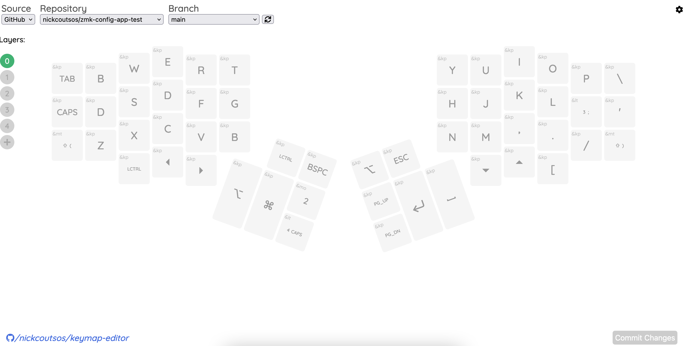

# Keymap Editor

A browser app (plus NodeJS server) to edit ZMK keymaps. This is still in its
infancy and doesn't yet support parsing existing ZMK keymaps which limits some
kinds of functionality (mainly those involving custom/configured behaviours).

## Setup

You've got a couple of options:

### Local

You can clone this repo and your zmk-config and run the editor locally. Changes
are saved to the keymap files in your local repository and you can commit and
push them to as desired to trigger the GitHub Actions build.

Read more about [local setup](running-locally.md)

### Web

This editor has a (very) rudimentary GitHub integration. You can load the web
app and grant it access to your zmk-config repo. Changes to your keymap are
committed right back to the repository so you only ever need to leave the app to
download your firmware.

Try it now:

1. Fork [zmk-config-corne-demo] on GitHub
2. Go to [keymap-editor] and authorize it to access your forked repo.

Read more about the [GitHub integration](api/services/github/README.md)

## Features

* WYSIWYG keycode and layer editing.
* Keymap (JSON and `.keymap`) generation
  * If the (non-standard) `row` and `col` attributes are specified in
    `info.json` they will be used to render the generated files in a more human-
    readable format that matches the physical layout of the keyboard. Note that
    these values are now the rol and column of the wiring matrix which may be
    different to use GPIO pins more efficiently.

#### ZMK Behaviours

The app tries to treat both firmware libraries the same way, parsing a key
binding into a `behaviour` and a list of `parameters` -- QMK doesn't share this
concept so a placeholder behaviour of `&kp` is used, and later ignored.

I haven't studied all of ZMK's behaviours closely but this tool supports the
unusual `&bt BT_SEL` behaviour/command which requires one additional parameter
which needs to be added/parsed dynamically.

Side note: I'm Canadian and default to writing behavio*ur*. To match ZMK I will
try to standardize on its spelling but mistakes are likely.

## What's broken/missing

Probably a lot. Like I said, I've mostly built this for myself. I wanted a
graphical way to edit my keymap and I didn't want to have to get yet another
handwired keyboard merged into the QMK repo to rely on their configurator.

I know that QMK moves quickly and now  supports a lot of configuration in
`info.json` that I don't provide a way to edit. ZMK has a lot of behaviours that
I haven't defined, and would benefit from a schema definition agreed on by the
dev team.

Some ZMK behaviours can be configured and some nodes of the device tree can be
aliased, but I don't understand it well enough to make these first-class
editable resources in this tool. As a short term solution I've added simplistic
"templating" of an existing keymap file. If your repository includes a file
called `config/*.keymap.template` the editor will replace the following tags
with the appropriate generated code

* `{{behaviour_includes}}`
* `{{rendered_layers}}`

Note that "simplistic" means "find-and-replace" and doesn't support templating
other content of each layer section. So you may be able to define encoders in
your keymap template but you can't make per-layer bindings for them.

### What else?

If you have thoughts on what needs to be fixed to support _your_ keyboard or to
make this a useful tool for users of either firmware, let me know.

I'm not committing to taking this on myself, and I'll probably never do much
testing on any other keyboards, but I'm happy to have discussions on where this
(or another tool) can go.

## License

The code in this repo is available under the MIT license.

The collection of ZMK keycodes is taken from the ZMK documentation under the MIT
license as well.

[keymap-editor]: https://nickcoutsos.github.io/keymap-editor/
[zmk-config-corne-demo]: https://github.com/nickcoutsos/zmk-config-corne-demo
