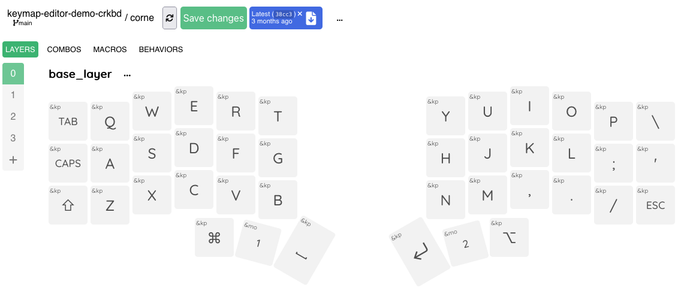

#  Keymap Editor

A browser app to edit ZMK keymaps. Although one of the goals for this project is
to simplify the manual effort of keymap editing for the end user, is isn't a
substitute for understanding ZMK. Be sure to read ZMK's documentation in order
to fully leverage this app's functionality.

**Try it now!** Go to the [Keymap Editor] and try it out with the built-in
[keymap-editor-demo-crkbd] before setting up your own repo.

**[Talk to me! 🗣](https://github.com/nickcoutsos/keymap-editor/discussions)**

I'd love to know how the Keymap Editor is working out for you! Has it helped you
with managing your own keymaps, are you struggling with functionality, have you
created your own keyboard and directed users here?

I want to know about all of that. I'm not taking any donations, the only thing
driving this work forward is knowing what is or isn't helping people.

<picture>
  <source media="(prefers-color-scheme: dark)" srcset="./screenshots/editor-screenshot-dark.png">
  <source media="(prefers-color-scheme: light)" srcset="./screenshots/editor-screenshot-light.png">
  
</picture>

> **Note**
>
> **Source code updates are no longer shared here**
>
> I have been developing this application on and off since August 2020, but more
> recent source changes have not been published and this isn't likely to change
> any time soon. For more information see [Wiki: Source Code Updates]
>
> If you do want to use the available source code as-is, you may wish to review
> the [original README](old-readme.md).

## Features

* WYSIWYG keymap editing
* Multiple keymap sources:
  * GitHub repositories
  * Clipboard
  * File system\*
* [Dark mode!](./screenshots/editor-screenshot-darkmode.png)
* Conditional Layers
* [Combo editing](./screenshots/editor-screenshot-combos.png)
* [Macro editing](./screenshots/editor-screenshot-macros.png) (including support for creating/using parameterized macros)
* Behavior editing (creation and re-configuration)
* Auto-generated layouts for ZMK's supported keyboards\*\*
* Rotary encoders
* Multiple keymaps

\*_File system web APIs are currently only supported in Chromium-based browsers_

\*\*_Auto-generated layouts are meant as a starting-off point and are provided for most keyboards available in the ZMK repo and may need customization -- I own exactly one keyboard, I don't know all the layouts._

_Read more: [Wiki:Features]_

## Usage

### Local

This project runs as a web application, but there are still options for working
with offline ZMK keymaps:

In the editor you can choose the _Clipboard_ keymap source and paste in the
contents of your ZMK `.keymap` file, and if you're using a Chromium-based web
browser you can alternatively use the _FileSystem_ source to read and make 
changes to select `.keymap` files directly.

Actual firmware builds are outside of the scope of this project, so if you're
working on local keymap data it is assumed that you have a local ZMK development
environment or some other means of running builds.

### Web Integrations

This editor includes a GitHub integration. You can load the web app and grant it
access to your public or private zmk-config repos. Changes to your keymap are
committed right back to the repository so you only ever need to leave the app to
download and flash firmware.

## License

The code in this repo is available under the MIT license.

The collection of ZMK keycodes is taken from the ZMK documentation under the MIT
license as well.

[Keymap Editor]: https://nickcoutsos.github.io/keymap-editor/
[keymap-editor-demo-crkbd]: https://github.com/nickcoutsos/keymap-editor-demo-crkbd/
[keymap-editor-demo-crkbd template]: https://github.com/nickcoutsos/keymap-editor-demo-crkbd/generate
[Wiki:Automatic Layout Generation]: https://github.com/nickcoutsos/keymap-editor/wiki/Defining-keyboard-layouts#automatic-layout-generation
[Wiki:Features]: https://github.com/nickcoutsos/keymap-editor/wiki/Features
[Wiki: Source Code Updates]: https://github.com/nickcoutsos/keymap-editor/wiki/Source-Code-Updates
